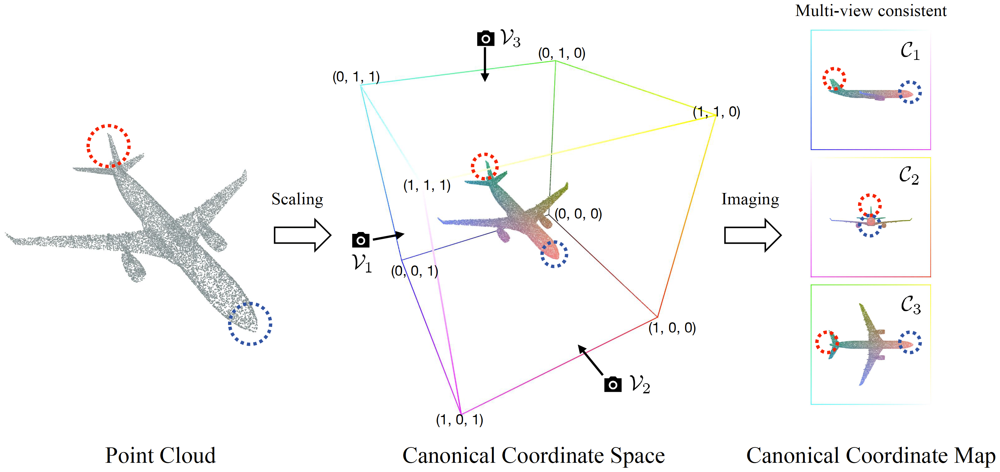
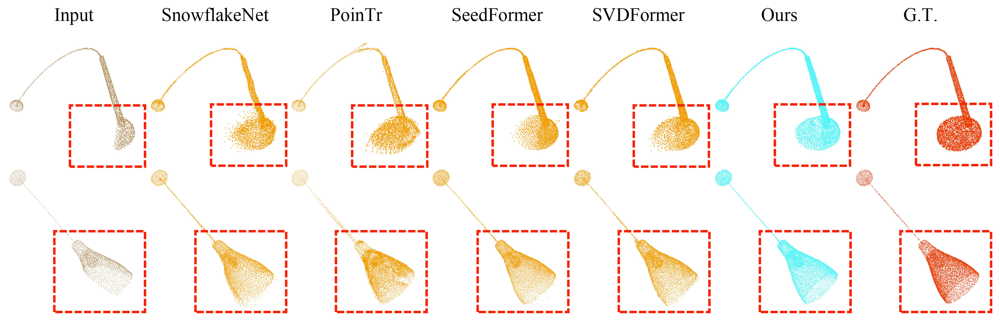

# GeoFormer: Learning Point Cloud Completion with Tri-Plane Integrated Transformer



This repository contains the PyTorch implementation for:

**GeoFormer: Learning Point Cloud Completion with Tri-Plane Integrated Transformer** (**ACM MM 2024**).  
Jinpeng Yu, Binbin Huang, Yuxuan Zhang, Huaxia Li, Xu Tang, Shenghua Gao

**[Paper]**(coming soon) **[datasets]**(coming soon) **[models]**(coming soon) **[results]**(coming soon)

## Abstract
In this paper, we introduce a GeoFormer that simultaneously enhances the global geometric structure of the points and improves the local details. Specifically, we design a **CCM Feature Enhanced Point Generator** to integrate image features from multi-view consistent canonical coordinate maps (CCMs) and align them with pure point features, thereby enhancing the global geometry feature. Additionally, we employ the **Multi-scale Geometry-aware Upsampler** module to progressively enhance local details. This is achieved through cross attention between the multi-scale features extracted from the partial input and the features derived from previously estimated points.



## 🔥News

## Usage

## Acknowledgements
The repository is based on [SeedFormer](https://github.com/hrzhou2/seedformer), some parts of the code are borrowed from:
- [PoinTr](https://github.com/yuxumin/PoinTr)
- [SnowflakeNet](https://github.com/AllenXiangX/SnowflakeNet)
- [SVDFormer](https://github.com/czvvd/SVDFormer_PointSea)
- [GRNet](https://github.com/hzxie/GRNet)

We utilize [MeshLab](https://github.com/cnr-isti-vclab/meshlab) to visualize the point cloud completion results.

We thank the authors for their excellent works.

## BibTeX
If you find our work useful in your reasearch, please consider citing:
```
```